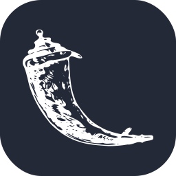
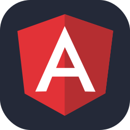
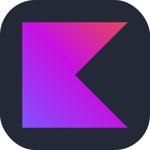

### Hi there 👋, I'am Kaik

 
 

- I'm a **beginner programmer** 
- I like to use various tools and **learn from them**
- I like to try **new experiences**
- I came into contact with programming as a child and have **never let it go since.**
- I've always liked this branch that always **fascinates me ❤️.**

**Talking About Personal Stuff:**

- 👨 🏛 I am currently a student at **State School of Professional Education**.
- 🌱 I'm currently learning **Web Development and English**. 
- 🤔 My hobbies are playing **logical thinking games and programming**.
- 💬 If you have any questions, **just ask me**.
- This is my email: **fkaik2019@gmail.com**.

**Languages and Tools:**  

<code></code>
<code></code>
<code></code>
<code></code>
<code></code>
<code></code>
<code></code>
<code></code>
<code></code>
<code></code>
<code></code>

 

**Technology being learned**

<code></code>
<code></code>
<code></code>
<code></code>
<code></code>
<code></code>
<code></code>
<code></code>
<code></code>
<code></code>
<code></code>
<code></code>
<code></code>
<code></code>
<code></code>

**Favorite sites**

<code></code>
<code></code>
<code></code>
<code></code>
<code></code>
<code></code>
<code></code>
<code></code>

<!--
**KaikMcpe12/KaikMcpe12** is a ✨ _special_ ✨ repository because its `README.md` (this file) appears on your GitHub profile.

Here are some ideas to get you started:

- 🔭 I’m currently working on ...
- 🌱 I’m currently learning ...
- 👯 I’m looking to collaborate on ...
- 🤔 I’m looking for help with ...
- 💬 Ask me about ...
- 📫 How to reach me: ...
- 😄 Pronouns: ...
- ⚡ Fun fact: ...
-->
